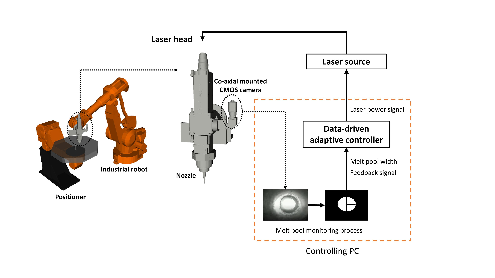

# Closed-loop feedback control for laser aided additive manufacturing (LAAM) process
## Introduction
This is the code repository for paper entitled "Data-Driven Adaptive Control for Laser-Based Additive Manufacturing with Automatic Controller Tuning"




<!--  -->

#### Citation
If you find our work useful in your research, please cite our paper:

[Publication](https://www.mdpi.com/2076-3417/10/22/7967):

   Chen L, Yao X, Chew Y, Weng F, Moon SK, Bi G. Data-Driven Adaptive Control for Laser-Based Additive Manufacturing with Automatic Controller Tuning. Applied Sciences. 2020; 10(22):7967. https://doi.org/10.3390/app10227967


### System requirements
##### master branch
- Ubuntu 18.04
- ROS Melodic
- Python3
   
Instructions on ROS installation:
http://wiki.ros.org/melodic/Installation/Ubuntu
We recommend to install ROS on Ubuntu 18 system (not on virtual machine), but the code should work fine on Windows or Virtual enviornment for testing. 

##### ROS2-foxy branch
- to be updated 
##### Noetic branch
- to be updated 


# Instructions
To build the workspace:
- delete build and devel folder:
   ```
   catkin clean
   ```
- navigate to __src/labjack_ros/dependency__ folder to check the instructions on installation of LabJack related dependent packages
- Build and Install USB Camera driver: http://wiki.ros.org/usb_cam
- Build and install vision-opencv package: http://wiki.ros.org/vision_opencv
- Note that vision-opencv package can only be used with python2 (in meldoic), not python3
- Navigate to workspace folder, Build the whole workspace with default setting: ```catkin_make```
- Navigate to workspace to build, __force to build with python3 instead of python2__
   ```
   catkin_make -DPYTHON_EXECUTABLE=/usr/bin/python3
   ```

## Parameters Configurations
- USB camera number: in __camera_monitoring/launch__ folder, change the ```"/dev/video0"``` value in camera_monitoring.launch file, try ```"/dev/video1"``` or other value such as -1,2 to connect to your USB camera device
- Define customized parameters such as min and max power range, and setpoint of melt pool width in: `~/laam_control_ws/src/laam_laser_control/config/control_parameters.yaml`
- Be aware of the code in __~/laam_control_ws/src/laam_laser_control/src/control/control.py__, which implements the actual PID control algorithm. There are several details needs to be addressed.

## Running the program
- To launch the data-driven PID controller (the whole program):
  navigate to `laam_laser_control/launch` folder and execute __vrft_adaptive_autocontrol.launch__ file
   ```
   cd ~/laam_control_ws/src/laam_laser_control/launch
   roslaunch vrft_adaptive_autocontrol.launch
   ```

- To test the usb camera with in-situ image processing functionalities:
  navigate to `camera_monitoring/launch` folder and execute __camera_monitoring.launch__ file
   ```
   cd ~/laam_control_ws/src/camera_monitoring/launch
   roslaunch camera_monitoring.launch
   ```

### Some recommendations for future development:
Currently, our implementation using Python is just a "proof-of-concept" implementation. To further improve the code:
  - Upgrade to ROS Noetic/ROS2 foxy, and replace the Python image processing Code to C++. 
  - Actually, OpenCV ROS apps provides several packages for image processing, which uses C++ and is fast. But it still in the development stage: http://wiki.ros.org/opencv_apps.
  - Increase Camera sampling rate. Enable faster response of the closed-loop controller. 


### Reference
- Part of the code is written on top of ROS packages from OpenLMD.
  - [OpenLMD](https://github.com/openlmd)
  - [OpenLMD publications](https://www.sciencedirect.com/science/article/abs/pii/S0736584517303770)

  
- Other related projects from our research group on process monitoring and control for LAAM:
  - [Rapid surface defect identification for additive manufacturing with in-situ point cloud processing and machine learning](https://www.tandfonline.com/doi/abs/10.1080/17452759.2020.1832695)

